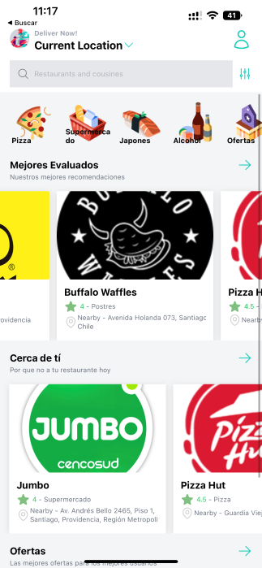
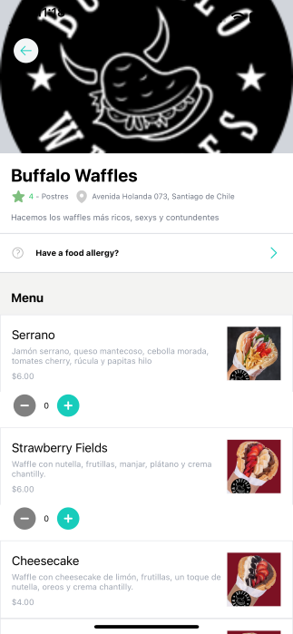
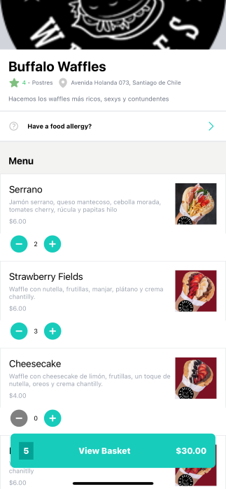
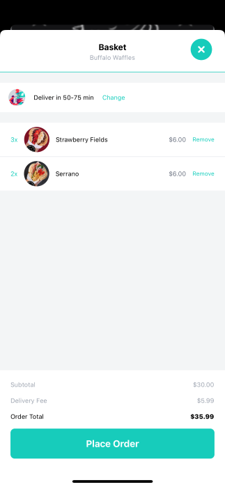
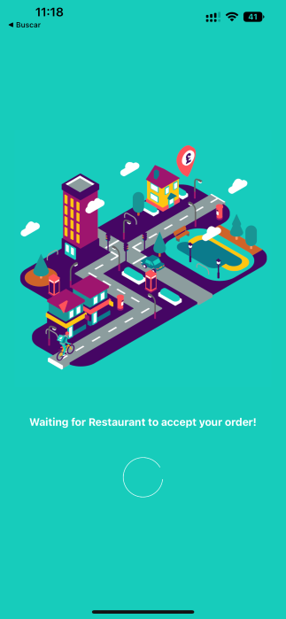
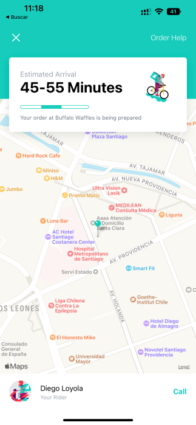

# React Native Delivery App

Delivery App with React Native and maps using Expo 💟

## Screenshots








## Installation

Install and initialize the project cloning this repository

Note: This project was build with Expo CLI 🚀

(You can emulate this app in your own device iOS device with Expo GO)

```bash
  cd my-project
  npm install
  expo start
```

## Tech

This project used:

- React
- React Native
- Expo
- Sanity
- Tailwind CSS
- React Native Maps
- Redux Toolkit
